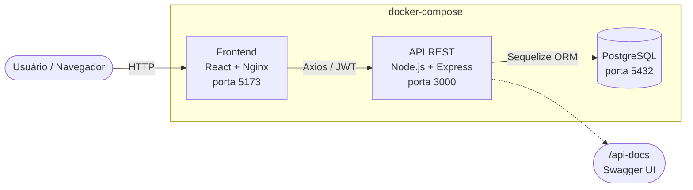
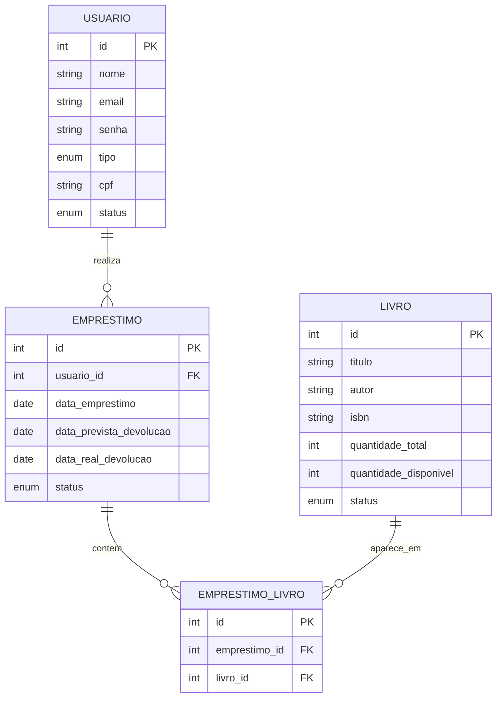

# Sistema de Biblioteca

Sistema full-stack de gerenciamento de biblioteca com autenticação por perfis, controle de empréstimos com múltiplos livros, detecção automática de atraso e dashboard de indicadores. Desenvolvido como projeto acadêmico, totalmente containerizado com Docker.


## Sumário

- [Sistema de Biblioteca](#sistema-de-biblioteca)
  - [Sumário](#sumário)
  - [Visão Geral](#visão-geral)
  - [Funcionalidades](#funcionalidades)
  - [Arquitetura](#arquitetura)
  - [Modelo de Dados](#modelo-de-dados)
  - [Tecnologias](#tecnologias)
    - [Backend](#backend)
    - [Frontend](#frontend)
    - [DevOps](#devops)
  - [Perfis de Usuário e Permissões](#perfis-de-usuário-e-permissões)
  - [Como Executar](#como-executar)
    - [Pré-requisitos](#pré-requisitos)
    - [Opção 1 — Docker](#opção-1--docker)
    - [Opção 2 — Manual (sem Docker)](#opção-2--manual-sem-docker)
  - [Credenciais de Teste](#credenciais-de-teste)
  - [Documentação da API](#documentação-da-api)
  - [Regras de Negócio](#regras-de-negócio)
  - [Estrutura de Pastas](#estrutura-de-pastas)
  - [Segurança](#segurança)
  - [Limitações e Próximos Passos](#limitações-e-próximos-passos)
  - [Equipe](#equipe)
  - [Licença](#licença)

## Visão Geral

O sistema cobre o ciclo completo de uma biblioteca: cadastro de acervo, cadastro de usuários com três perfis de acesso distintos, registro de empréstimos (com suporte a múltiplos livros por empréstimo), devoluções com cálculo automático de atraso, e um dashboard com indicadores para a administração.

A API é uma REST API documentada via Swagger, com autenticação JWT e autorização por perfil (RBAC) aplicada em nível de rota. O frontend é uma SPA em React que consome essa API e adapta a navegação de acordo com o perfil do usuário logado.

## Funcionalidades

**Autenticação e Perfis**
- Login com JWT e três perfis: Administrador, Bibliotecário e Leitor
- Alteração da própria senha
- Acesso e navegação adaptados por perfil, tanto na API quanto na interface

**Usuários**
- CRUD completo, com busca e filtros por tipo/status
- Validação matemática de CPF (dígitos verificadores) no frontend e no backend
- Ativação/inativação de leitores

**Acervo (Livros)**
- CRUD completo, com busca e filtro por status de disponibilidade
- Controle automático de exemplares disponíveis

**Empréstimos**
- Um empréstimo pode incluir vários livros simultaneamente
- Bloqueios automáticos: livro indisponível, leitor inativo, data de devolução no passado
- Detecção automática de atraso (comparando com a data atual a cada consulta)
- Registro de devolução com cálculo de dias de atraso
- Histórico de empréstimos por leitor

**Dashboard (somente Administrador)**
- Indicadores gerais (empréstimos, livros, leitores)
- 4 gráficos: status dos empréstimos, evolução mensal (6 meses), livros por categoria, top 5 livros mais emprestados

## Arquitetura



Três serviços orquestrados pelo `docker-compose.yml`: banco PostgreSQL, API Node.js/Express, e frontend React compilado e servido por Nginx (que também resolve o roteamento client-side da SPA).

## Modelo de Dados



`emprestimo_livros` é uma tabela de junção N:N entre `Emprestimo` e `Livro`, o que permite que um único empréstimo contenha vários livros — cada linha decrementa `quantidade_disponivel` do livro correspondente.

## Tecnologias

### Backend

| Tecnologia | Versão | Função |
|---|---|---|
| Node.js | 18+ | Ambiente de execução JavaScript |
| Express | ^5.2 | Framework web da API REST |
| Sequelize | ^6.37 | ORM para acesso ao PostgreSQL |
| PostgreSQL | 14+ (16 no Docker) | Banco de dados relacional |
| jsonwebtoken | ^9.0 | Autenticação via JWT |
| bcryptjs | ^3.0 | Hash de senhas |
| Joi | ^18.2 | Validação de entrada das requisições |
| Day.js | ^1.11 | Cálculo de datas e dias de atraso |
| swagger-jsdoc / swagger-ui-express | ^6.3 / ^5.0 | Documentação interativa em `/api-docs` |
| Helmet | ^8.2 | Cabeçalhos HTTP de segurança |
| Morgan | ^1.11 | Log de requisições HTTP |
| Compression | ^1.8 | Compressão Gzip das respostas |
| express-rate-limit | ^8.5 | Limite de requisições (anti brute-force) |
| CORS | ^2.8 | Controle de acesso entre origens |
| dotenv | ^17.4 | Variáveis de ambiente |

### Frontend

| Tecnologia | Versão | Função |
|---|---|---|
| React | ^19.2 | Biblioteca de interface |
| React Router DOM | ^7.18 | Roteamento client-side (SPA) |
| Axios | ^1.18 | Cliente HTTP com injeção automática do JWT |
| React Toastify | ^11.1 | Notificações visuais |
| Recharts | ^3.9 | Gráficos do dashboard |
| CSS Modules | — | Estilização isolada por componente |

### DevOps

| Ferramenta | Função |
|---|---|
| Docker / Docker Compose | Orquestra os 3 serviços (banco, API, frontend) |
| Nginx | Serve o build estático do React e resolve o roteamento da SPA |

## Perfis de Usuário e Permissões

| Ação | Administrador | Bibliotecário | Leitor |
|---|---|---|---|
| Login e ver o próprio perfil | ✅ | ✅ | ✅ |
| Alterar a própria senha | ✅ | ✅ | ✅ |
| Listar usuários | ✅ todos os perfis | ✅ somente leitores | ❌ |
| Ver usuário por ID | ✅ qualquer um | ✅ qualquer um | ✅ somente o próprio |
| Cadastrar / editar usuários | ✅ qualquer perfil | ✅ somente leitores | ❌ |
| Excluir usuários | ✅ | ❌ | ❌ |
| Listar / ver livros | ✅ | ✅ | ✅ |
| Cadastrar / editar livros | ✅ | ✅ | ❌ |
| Excluir livros | ✅ | ❌ | ❌ |
| Listar empréstimos | ✅ todos | ✅ todos | ✅ somente os próprios |
| Registrar empréstimo / devolução | ✅ | ✅ | ❌ |
| Ver empréstimos atrasados (visão geral) | ✅ | ✅ | ❌ |
| Ver histórico de empréstimos de um leitor | ✅ qualquer um | ✅ qualquer um | ✅ somente o próprio |
| Ver relatório / dashboard | ✅ | ❌ | ❌ |

A autorização é aplicada em duas camadas: middleware de rota (`autorizar(...perfis)`) e, quando necessário, checagens adicionais no controller (por exemplo, um leitor só acessa seus próprios empréstimos mesmo em rotas abertas a "qualquer autenticado").

## Como Executar

### Pré-requisitos

- **Opção 1 (recomendada):** Docker e Docker Compose
- **Opção 2 (manual):** Node.js 18+ e PostgreSQL 14+

### Opção 1 — Docker

```bash
# 1. Na raiz do projeto, crie o .env a partir do modelo
cp .env.example .env
# edite o .env e defina DB_PASSWORD e JWT_SECRET (veja instruções dentro do arquivo)

# 2. Suba os containers
docker compose up --build

# 3. Em outro terminal, popule o banco (apenas na primeira vez)
docker compose exec api npm run seed
```

Acessos:
- Frontend: http://localhost:5173
- API: http://localhost:3000
- Swagger: http://localhost:3000/api-docs

### Opção 2 — Manual (sem Docker)

**Backend**
```bash
cd api
cp .env.example .env
# edite o .env com as credenciais do seu PostgreSQL local

# crie o banco (via psql ou pgAdmin):
# CREATE DATABASE biblioteca;

npm install
npm run seed     # apenas na primeira vez
npm start         # ou "npm run dev" para usar o nodemon
```
Servidor em `http://localhost:3000`, Swagger em `http://localhost:3000/api-docs`.

**Frontend**
```bash
cd frontend
npm install
npm start
```
Como a API já ocupa a porta 3000, o Create React App vai detectar o conflito e perguntar se pode subir em outra porta — responda `Y`. O frontend abre em `http://localhost:3001`.

## Credenciais de Teste

Criadas pelo script de seed (`npm run seed`):

| Perfil | E-mail | Senha |
|---|---|---|
| Administrador | admin@biblioteca.com | 123456 |
| Bibliotecário | lavinia@biblioteca.com | 123456 |
| Leitor | arthur@leitor.com | 123456 |
| Leitor | conrado@leitor.com | 123456 |

> Credenciais de teste/desenvolvimento apenas. As senhas ficam armazenadas com hash bcrypt no banco.

## Documentação da API

Com o servidor rodando, a documentação interativa (Swagger UI) fica em `/api-docs`. Para testar rotas autenticadas, faça login em `/auth/login`, copie o token retornado e clique em **Authorize** informando `Bearer SEU_TOKEN`.

<details>
<summary><strong>Referência rápida de endpoints</strong></summary>

**Autenticação** — `/auth`

| Método | Rota | Descrição | Acesso |
|---|---|---|---|
| POST | `/auth/login` | Login, retorna token JWT | Público |
| GET | `/auth/perfil` | Dados do usuário logado | Autenticado |
| PUT | `/auth/alterar-senha` | Altera a própria senha | Autenticado |

**Usuários** — `/usuarios`

| Método | Rota | Descrição | Acesso |
|---|---|---|---|
| GET | `/usuarios` | Lista usuários (filtros: `tipo`, `status`, `busca`) | Admin, Bibliotecário |
| GET | `/usuarios/:id` | Busca usuário por ID | Autenticado (leitor: só o próprio) |
| POST | `/usuarios` | Cadastra usuário | Admin, Bibliotecário |
| PATCH | `/usuarios/:id` | Atualiza usuário | Admin, Bibliotecário |
| DELETE | `/usuarios/:id` | Exclui usuário | Admin |

**Livros** — `/livros`

| Método | Rota | Descrição | Acesso |
|---|---|---|---|
| GET | `/livros` | Lista livros (filtros: `busca`, `status`) | Autenticado |
| GET | `/livros/:id` | Busca livro por ID | Autenticado |
| POST | `/livros` | Cadastra livro | Admin, Bibliotecário |
| PATCH | `/livros/:id` | Atualiza livro | Admin, Bibliotecário |
| DELETE | `/livros/:id` | Exclui livro (bloqueado se houver empréstimo em aberto) | Admin |

**Empréstimos** — `/emprestimos`

| Método | Rota | Descrição | Acesso |
|---|---|---|---|
| GET | `/emprestimos` | Lista empréstimos (filtros: `status`, `usuario_id`, `livro_id`, datas) | Autenticado (leitor: só os próprios) |
| GET | `/emprestimos/atrasados` | Lista empréstimos atrasados | Admin, Bibliotecário |
| GET | `/emprestimos/relatorio` | Indicadores e dados para os gráficos do dashboard | Admin |
| GET | `/emprestimos/historico/:id` | Histórico de empréstimos de um leitor | Autenticado (leitor: só o próprio) |
| GET | `/emprestimos/:id` | Busca empréstimo por ID | Autenticado |
| POST | `/emprestimos` | Registra empréstimo (um ou mais livros) | Admin, Bibliotecário |
| PATCH | `/emprestimos/:id/devolucao` | Registra devolução | Admin, Bibliotecário |

</details>

## Regras de Negócio

- CPF validado matematicamente (algoritmo dos dígitos verificadores, módulo 11), no frontend e no backend — obrigatório para leitores.
- Um empréstimo pode conter vários livros; cada exemplar decrementa `quantidade_disponivel` do respectivo livro, e a devolução incrementa de volta.
- Não é possível: emprestar um livro sem exemplares disponíveis, registrar empréstimo para leitor inativo, ou definir data de devolução prevista no passado.
- O status `em_aberto → atrasado` é recalculado automaticamente a cada consulta, comparando a data prevista com a data atual.
- Na devolução, o sistema calcula os dias de atraso com base na data prevista.
- Um livro não pode ser excluído enquanto tiver empréstimos em aberto ou atrasados.
- Um usuário não pode excluir a própria conta; exclusão de usuários é restrita ao Administrador.
- Bibliotecários só enxergam e gerenciam usuários do tipo leitor, e não podem alterar o campo `tipo` de um usuário.

## Estrutura de Pastas

```
ProjetoBiblioteca/
├── api/                      # Backend (Node.js + Express)
│   ├── config/               # Configuração do Sequelize / PostgreSQL
│   ├── controllers/          # Regras de negócio de cada recurso
│   ├── middlewares/          # autenticar (JWT) e autorizar (RBAC)
│   ├── models/                # Usuario, Livro, Emprestimo, EmprestimoLivro
│   ├── routes/                # Rotas + documentação Swagger (JSDoc)
│   ├── seeders/               # Script de seed (usuários e livros iniciais)
│   ├── validators/            # Schemas Joi
│   ├── .env.example
│   ├── app.js                 # Ponto de entrada da API
│   └── Dockerfile
├── frontend/                  # Frontend (React)
│   ├── public/
│   └── src/
│       ├── api/                # Instância do Axios com injeção de JWT
│       ├── components/         # Layout e componentes de UI reutilizáveis
│       ├── pages/               # Login, Livros, Usuários, Empréstimos, Relatório, Perfil
│       └── styles/               # CSS Modules
│   └── Dockerfile
├── docker-compose.yml
├── .env.example                # Variáveis usadas pelo docker-compose
├── .gitignore
├── LICENSE
└── README.md
```

## Segurança

- Senhas com hash bcrypt (nunca armazenadas em texto puro)
- Autenticação via JWT com expiração configurável
- Autorização por perfil (RBAC) aplicada em nível de rota
- Helmet para cabeçalhos HTTP seguros
- Rate limiting: 100 req/15min de forma geral, 10 req/15min no login
- Validação de entrada em todas as rotas (Joi) e nos formulários do frontend
- Segredos (senha do banco, JWT secret) ficam apenas em arquivos `.env` — nunca commitados. Use os `.env.example` como modelo.

## Limitações e Próximos Passos

- A URL da API no frontend está fixa em `http://localhost:3000` (sem variável de ambiente); para um deploy real, precisaria ser parametrizada.
- Ainda não há suíte de testes automatizados — durante o desenvolvimento, os testes foram feitos manualmente, com um banco PostgreSQL real e requisições HTTP reais.
- Sem pipeline de CI/CD configurado.
- Próximos passos possíveis: testes automatizados (Jest/Supertest no backend, React Testing Library no frontend), variável de ambiente para a URL da API no frontend, deploy em nuvem.


## Licença

Distribuído sob a licença MIT. Veja [LICENSE](LICENSE) para mais detalhes. Projeto desenvolvido para fins acadêmicos.
